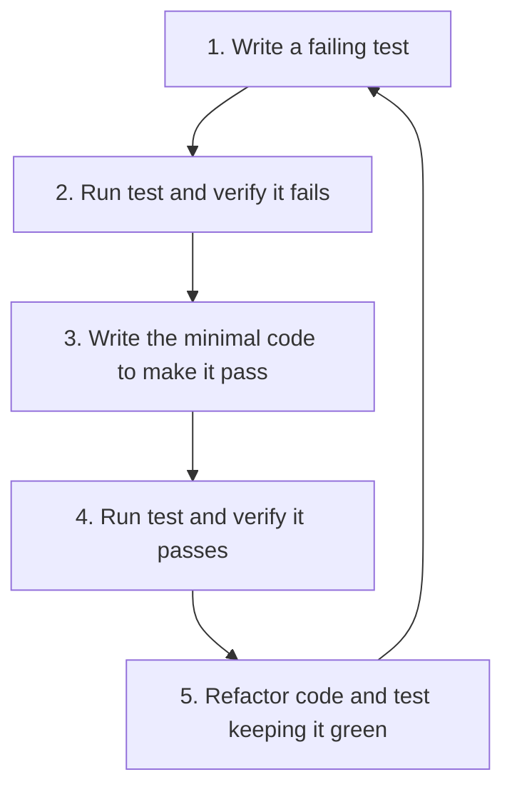

# SOLID, TDD & Design Patterns Rules

> Internal development guidelines for AI agents and developers.
> Read this to ensure software quality and architectural consistency in Ordenízate Bcn.

---

## 1. Test-Driven Development (TDD) Workflow

When adding new features or modifying existing logic, we strictly follow the TDD workflow:



### Rule: No Un-tested Code
* Every utility in `lib/` must have a corresponding `.test.ts` file in the same structure under `__tests__/`.
* Every new UI primitive or interactive component must have a corresponding `.test.tsx` file inside `__tests__/components/*`.
* Always write the test **before** writing the actual implementation to guarantee testability and avoid writing untestable monolithic chunks.

---

## 2. SOLID Principles in Next.js & React

We enforce SOLID software design principles:

### S — Single Responsibility Principle (SRP)
* A component or helper should do **one thing**.
* **Visual vs. Logic:** Keep presentation separated from business rules. If a component does data validation, API fetching, and complex animation, split it!
* **Rule:** If a component exceeds 150 lines, it is a candidate for decomposition.

### O — Open/Closed Principle (OCP)
* Components and systems should be **open for extension, but closed for modification**.
* Use polymorphism and configuration objects instead of hardcoded conditional (`if/else` or `switch`) statements.
* **Example:** The navigation bar reads an array config from `SITE_CONFIG` instead of hardcoding list items directly in the JSX.

### L — Liskov Substitution Principle (LSP)
* Subtypes/Props extensions must be substitutable for their base types.
* **Rule:** When creating custom wrappers over primitives (like a custom `Input` or `Button` component), always extend the standard HTML React types (e.g., `React.ButtonHTMLAttributes<HTMLButtonElement>`) and forward the ref.

### I — Interface Segregation Principle (ISP)
* Keep interfaces and props small and cohesive. No component should be forced to depend on props it does not use.
* **Rule:** Instead of passing a giant `Service` object containing 20 properties down to a simple preview card, pass only the specific primitive props needed (`title`, `description`, `icon`).

### D — Dependency Inversion Principle (DIP)
* Depend on abstractions, not on concrete implementations.
* **Rule:** Abstract external service integrations behind utility layers. For example, do not instantiate Upstash client directly inside route handlers; import it from structured abstraction modules in `lib/`.

---

## 3. Approved Design Patterns

We encourage and use the following structural and behavioral patterns:

| Pattern | Application | Location in Project |
| ------- | ----------- | ------------------- |
| **Strategy Pattern** | Handling different validation schemas or API payload processing. | `lib/contactSchema.ts` |
| **Configuration / Registry** | Centralized metadata, paths, and brand variables. | `lib/constants.ts` |
| **Compound Components** | Composing complex UI elements where parent and children maintain relative states. | `components/ui/*` |

---

## 4. Run Commands Checklist

Before declaring any task as finished, run the following validation cycle:

```bash
# 1. Run Unit Tests (Bypassing restrictive policies if needed)
powershell -ExecutionPolicy Bypass -Command "npx vitest run"

# 2. Verify compilation correctness
powershell -ExecutionPolicy Bypass -Command "npm run build"
```
